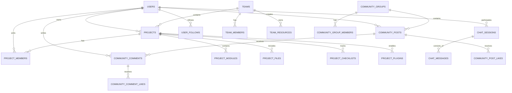

# IdeaSpark AI 项目孵化平台 - 数据库设计方案

本方案基于 **IdeaSpark AI** 前端项目的核心业务需求进行设计，旨在支撑从项目创意、产品定义到商业分析的全流程数据存储，并满足社区协作与 AI 对话的扩展需求。

## 一、 数据库关系图 (ER Diagram)

## 二、 业务模块与表结构概览

本系统包含 **20 张数据表**，按业务域划分为五大核心体系。

### 1. 团队与空间体系 (Foundation)
用户管理资源的基础容器，对应前端左侧栏的“个人空间”和“团队空间”。
- **`teams`**: 核心容器，区分个人与团队空间。
- **`team_members`**: 管理团队成员与权限。
- **`team_resources`**: 团队共享的资源库/字体库。

### 2. 项目孵化体系 (Core)
业务最核心的部分，存储 AI 辅助生成的各类产出。
- **`projects`**: 项目主体，归属于团队/空间。
- **`project_modules`**: **(核心)** 存储各阶段（创意、UI、文档）的动态表单数据。
- **`project_files`**: 存储生成的文档、PPT大纲、表格等文件。
- **`project_checklists`**: 项目任务与进度追踪。
- **`plugins`** & **`project_plugins`**: 管理项目启用的 AI 插件。

### 3. AI 对话体系 (Interaction)
支持右侧边栏的 AI 助手聊天记录。
- **`chat_sessions`**: 对话会话，可关联特定项目。
- **`chat_messages`**: 具体的消息记录。

### 4. 社区互动体系 (Community)
对应“资源社区”板块，支持成果分享与交流。
- **`community_groups`**: 兴趣圈子/话题小组。
- **`community_posts`**: 帖子/动态，支持从项目一键发布。
- **`community_comments`**: 评论（支持二级回复）。
- **`community_post_likes`** & **`community_comment_likes`**: 点赞记录与状态保持。

### 5. 用户与社交 (User)
- **`users`**: 基础账号信息。
- **`user_follows`**: 用户关注/粉丝关系。

## 三、 数据表详细定义

### 1. 用户表 (users)
存储用户的基本账户信息及社交统计。

| 字段名 | 类型 | 说明 | 约束 |
| :--- | :--- | :--- | :--- |
| id | UUID | 用户唯一标识 | Primary Key |
| username | VARCHAR(50) | 用户名 | Not Null |
| email | VARCHAR(100) | 电子邮箱 | Unique, Not Null |
| password_hash | VARCHAR(255) | 密码哈希值 | Not Null |
| avatar | VARCHAR(255) | 头像 URL | - |
| role | VARCHAR(50) | 用户角色/头衔 | - |
| bio | TEXT | 个人简介 | - |
| likes_count | INT | 获赞数 | Default 0 |
| followers_count | INT | 粉丝数 | Default 0 |
| following_count | INT | 关注数 | Default 0 |
| created_at | TIMESTAMP | 创建时间 | - |
| updated_at | TIMESTAMP | 更新时间 | - |

### 2. 用户关注关系表 (user_follows)
用于实现“关注/粉丝”关系，并支撑用户主页的关注列表。

| 字段名 | 类型 | 说明 | 约束 |
| :--- | :--- | :--- | :--- |
| id | UUID | 关注记录唯一标识 | Primary Key |
| follower_id | UUID | 关注者用户 ID | FK(users.id) |
| following_id | UUID | 被关注者用户 ID | FK(users.id) |
| created_at | TIMESTAMP | 关注时间 | - |

> **设计备注**：建议添加约束 `Unique(follower_id, following_id)` 防止重复关注，以及 `Check(follower_id <> following_id)` 防止自关注。

### 3. 项目表 (projects)
存储项目的主体信息、当前进度及可见性设置。

| 字段名 | 类型 | 说明 | 约束 |
| :--- | :--- | :--- | :--- |
| id | UUID | 项目唯一标识 | Primary Key |
| owner_id | UUID | 所有者 ID | FK(users.id) |
| team_id | UUID | 归属团队/空间 | FK(teams.id), Nullable |
| parent_id | UUID | 源项目 ID（用于 Fork） | FK(projects.id), Nullable |
| name | VARCHAR(100) | 项目名称 | Not Null |
| description | TEXT | 短描述 | - |
| detailed_description | TEXT | 详细描述 (HTML/Markdown) | - |
| category | VARCHAR(50) | 项目类别 | - |
| cover_url | VARCHAR(255) | 项目封面图 URL | - |
| type | VARCHAR(20) | 项目类型 (app, document) | - |
| current_module | VARCHAR(30) | 当前所处阶段 | - |
| status | VARCHAR(20) | 状态 (active, draft, completed) | - |
| progress | INT | 总体进度百分比 (0-100) | - |
| visibility | VARCHAR(10) | 可见性 (public, private) | - |
| allow_fork | BOOLEAN | 是否允许他人分叉 | Default true |
| created_at | TIMESTAMP | 创建时间 | - |
| updated_at | TIMESTAMP | 更新时间 | - |

### 4. 团队表 (teams)
统一抽象“个人空间”与“团队空间”。

| 字段名 | 类型 | 说明 | 约束 |
| :--- | :--- | :--- | :--- |
| id | UUID | 团队唯一标识 | Primary Key |
| owner_id | UUID | 团队所有者 | FK(users.id) |
| name | VARCHAR(100) | 团队名称 | Not Null |
| is_personal | BOOLEAN | 是否个人空间 | Default false |
| avatar_url | VARCHAR(255) | 团队头像 | - |
| description | TEXT | 团队描述 | - |
| dissolved_at | TIMESTAMP | 解散时间 | Nullable |
| created_at | TIMESTAMP | 创建时间 | - |
| updated_at | TIMESTAMP | 更新时间 | - |

> **设计备注**：通过 `is_personal` 字段区分空间类型。建议添加约束 `Unique(owner_id, is_personal)` 确保每个用户只有一个个人空间。

### 5. 团队成员表 (team_members)
管理团队内的成员角色与权限。

| 字段名 | 类型 | 说明 | 约束 |
| :--- | :--- | :--- | :--- |
| id | UUID | 记录唯一标识 | Primary Key |
| team_id | UUID | 团队 ID | FK(teams.id) |
| user_id | UUID | 用户 ID | FK(users.id) |
| role | VARCHAR(20) | 角色 (owner, admin, member, visitor) | Not Null |
| joined_at | TIMESTAMP | 加入时间 | - |

### 6. 团队资源库表 (team_resources)
支撑团队页“资源库/字体库”入口。

| 字段名 | 类型 | 说明 | 约束 |
| :--- | :--- | :--- | :--- |
| id | UUID | 资源库唯一标识 | Primary Key |
| team_id | UUID | 所属团队 ID | FK(teams.id) |
| kind | VARCHAR(20) | 类型 (repo, fonts) | Not Null |
| name | VARCHAR(100) | 名称 | Not Null |
| item_count | INT | 资源条目数 | Default 0 |
| updated_at | TIMESTAMP | 更新时间 | - |
| created_at | TIMESTAMP | 创建时间 | - |

### 7. 项目成员表 (project_members)
用于项目级别的精细化协作控制。

| 字段名 | 类型 | 说明 | 约束 |
| :--- | :--- | :--- | :--- |
| id | UUID | 记录唯一标识 | Primary Key |
| project_id | UUID | 项目 ID | FK(projects.id) |
| user_id | UUID | 用户 ID | FK(users.id) |
| role | VARCHAR(20) | 角色 (owner, admin, member, visitor) | Not Null |
| joined_at | TIMESTAMP | 加入时间 | - |

### 8. 项目模块数据表 (project_modules)
**核心表**：采用 JSON 存储各模块（Idea, Product, Feasibility 等）的动态表单数据。

| 字段名 | 类型 | 说明 | 约束 |
| :--- | :--- | :--- | :--- |
| id | UUID | 记录唯一标识 | Primary Key |
| project_id | UUID | 所属项目 ID | FK(projects.id) |
| module_key | VARCHAR(30) | 模块 Key (如 idea, brand) | Not Null |
| module_data | JSONB | 模块内的表单数据 | - |
| updated_at | TIMESTAMP | 最后更新时间 | - |

> **设计备注**：使用 JSONB 是为了适应 AI 项目孵化不同阶段差异巨大的数据结构（如创意阶段存文本，UI阶段存配色对象），避免频繁修改表结构。

### 9. 项目清单表 (project_checklists)
跟踪项目各阶段的具体任务完成情况。

| 字段名 | 类型 | 说明 | 约束 |
| :--- | :--- | :--- | :--- |
| id | UUID | 任务唯一标识 | Primary Key |
| project_id | UUID | 所属项目 ID | FK(projects.id) |
| module_key | VARCHAR(30) | 所属模块 | - |
| label | VARCHAR(255) | 任务描述 | Not Null |
| is_completed | BOOLEAN | 是否完成 | Default false |
| description | TEXT | 任务补充说明 | - |
| priority | VARCHAR(10) | 优先级 | - |
| due_date | TIMESTAMP | 截止日期 | - |
| assignee_user_id | UUID | 负责人 | FK(users.id), Nullable |
| tags | JSONB | 标签数组 | - |
| created_at | TIMESTAMP | 创建时间 | - |
| updated_at | TIMESTAMP | 更新时间 | - |

### 10. 插件表 (plugins)
全平台通用的“应用商店”元数据。

| 字段名 | 类型 | 说明 | 约束 |
| :--- | :--- | :--- | :--- |
| id | UUID | 插件唯一标识 | Primary Key |
| key | VARCHAR(50) | 插件 Key | Unique, Not Null |
| name | VARCHAR(100) | 插件名称 | Not Null |
| category | VARCHAR(20) | 分类 | - |
| description | TEXT | 简介 | - |
| is_active | BOOLEAN | 是否启用 | Default true |
| created_at | TIMESTAMP | 创建时间 | - |
| updated_at | TIMESTAMP | 更新时间 | - |

### 11. 项目插件关联表 (project_plugins)
记录具体项目启用了哪些插件及顺序。

| 字段名 | 类型 | 说明 | 约束 |
| :--- | :--- | :--- | :--- |
| id | UUID | 记录唯一标识 | Primary Key |
| project_id | UUID | 项目 ID | FK(projects.id) |
| plugin_id | UUID | 插件 ID | FK(plugins.id) |
| sort_order | INT | 展示顺序 | Default 0 |
| created_at | TIMESTAMP | 创建时间 | - |

> **设计备注**：将“静态插件定义”与“动态项目配置”分离，支持按需启用和自定义排序。

### 12. 项目文件表 (project_files)
存储项目生成的各类交付物。

| 字段名 | 类型 | 说明 | 约束 |
| :--- | :--- | :--- | :--- |
| id | UUID | 文件唯一标识 | Primary Key |
| project_id | UUID | 所属项目 ID | FK(projects.id) |
| name | VARCHAR(100) | 文件名 | Not Null |
| type | VARCHAR(20) | 类型 (document, sheet, slide, image) | - |
| ext | VARCHAR(10) | 扩展名 | - |
| size | INT | 文件大小 (Bytes) | - |
| source | VARCHAR(20) | 来源 (system, plugin, upload) | - |
| plugin_id | UUID | 来源插件 | FK(plugins.id), Nullable |
| content | TEXT | 文件内容 | - |
| created_by | UUID | 创建者 | FK(users.id), Nullable |
| updated_by | UUID | 更新者 | FK(users.id), Nullable |
| created_at | TIMESTAMP | 创建时间 | - |
| updated_at | TIMESTAMP | 更新时间 | - |

### 13. AI 对话会话表 (chat_sessions)
存储 AI 聊天的上下文元数据。

| 字段名 | 类型 | 说明 | 约束 |
| :--- | :--- | :--- | :--- |
| id | UUID | 会话唯一标识 | Primary Key |
| user_id | UUID | 用户 ID | FK(users.id) |
| project_id | UUID | 关联项目 ID | FK(projects.id), Nullable |
| title | VARCHAR(100) | 对话标题 | - |
| model | VARCHAR(50) | 模型名称 | - |
| system_prompt | TEXT | 系统预设提示词 | - |
| created_at | TIMESTAMP | 开始时间 | - |
| updated_at | TIMESTAMP | 最后活跃时间 | - |

### 14. 对话消息表 (chat_messages)
存储具体的问答记录。

| 字段名 | 类型 | 说明 | 约束 |
| :--- | :--- | :--- | :--- |
| id | UUID | 消息唯一标识 | Primary Key |
| session_id | UUID | 所属会话 ID | FK(chat_sessions.id) |
| role | VARCHAR(10) | 角色 (user, ai, system) | Not Null |
| content | TEXT | 消息内容 | Not Null |
| message_type | VARCHAR(10) | 类型 (text, image, code) | - |
| language | VARCHAR(20) | 代码语言 | - |
| image_urls | JSONB | 图片 URL 数组 | - |
| created_at | TIMESTAMP | 发送时间 | - |

### 15. 社区圈子表 (community_groups)
实现“圈子/话题社区”聚合。

| 字段名 | 类型 | 说明 | 约束 |
| :--- | :--- | :--- | :--- |
| id | UUID | 圈子唯一标识 | Primary Key |
| name | VARCHAR(100) | 圈子名称 | Unique, Not Null |
| keyword | VARCHAR(50) | 匹配关键字 | - |
| icon_url | VARCHAR(255) | 图标 URL | - |
| cover_url | VARCHAR(255) | 封面 URL | - |
| description | TEXT | 圈子描述 | - |
| created_by | UUID | 创建者 | FK(users.id), Nullable |
| created_at | TIMESTAMP | 创建时间 | - |
| updated_at | TIMESTAMP | 更新时间 | - |

### 16. 圈子成员表 (community_group_members)
记录用户加入的圈子。

| 字段名 | 类型 | 说明 | 约束 |
| :--- | :--- | :--- | :--- |
| id | UUID | 记录唯一标识 | Primary Key |
| group_id | UUID | 圈子 ID | FK(community_groups.id) |
| user_id | UUID | 用户 ID | FK(users.id) |
| role | VARCHAR(20) | 圈子角色 | Default member |
| joined_at | TIMESTAMP | 加入时间 | - |

### 17. 社区帖子表 (community_posts)
核心内容单元，支持从项目一键发布。

| 字段名 | 类型 | 说明 | 约束 |
| :--- | :--- | :--- | :--- |
| id | UUID | 帖子唯一标识 | Primary Key |
| author_id | UUID | 作者 ID | FK(users.id) |
| project_id | UUID | 关联项目 ID | FK(projects.id), Nullable |
| group_id | UUID | 所属圈子 | FK(community_groups.id), Nullable |
| title | VARCHAR(255) | 帖子标题 | Nullable |
| content | TEXT | 帖子内容 | Not Null |
| images | JSONB | 图片 URL 数组 | - |
| tags | JSONB | 标签数组 | - |
| channel | VARCHAR(20) | 频道 | - |
| visibility | VARCHAR(20) | 可见性 | Default public |
| likes_count | INT | 点赞数 | Default 0 |
| comments_count | INT | 评论数 | Default 0 |
| views_count | INT | 浏览数 | Default 0 |
| created_at | TIMESTAMP | 发布时间 | - |
| updated_at | TIMESTAMP | 更新时间 | - |

### 18. 帖子点赞表 (community_post_likes)
记录点赞动作，防止重复点赞。

| 字段名 | 类型 | 说明 | 约束 |
| :--- | :--- | :--- | :--- |
| id | UUID | 记录唯一标识 | Primary Key |
| post_id | UUID | 帖子 ID | FK(community_posts.id) |
| user_id | UUID | 用户 ID | FK(users.id) |
| created_at | TIMESTAMP | 点赞时间 | - |

### 19. 评论表 (community_comments)
支持二级回复的评论系统。

| 字段名 | 类型 | 说明 | 约束 |
| :--- | :--- | :--- | :--- |
| id | UUID | 评论唯一标识 | Primary Key |
| post_id | UUID | 所属帖子 ID | FK(community_posts.id) |
| user_id | UUID | 评论者 ID | FK(users.id) |
| parent_id | UUID | 父评论 ID | FK(community_comments.id), Nullable |
| content | TEXT | 评论内容 | Not Null |
| likes_count | INT | 点赞数 | Default 0 |
| created_at | TIMESTAMP | 创建时间 | - |
| updated_at | TIMESTAMP | 更新时间 | - |

> **设计备注**：`parent_id` 为空表示对帖子的直接评论；不为空表示对评论的回复（楼中楼）。

### 20. 评论点赞表 (community_comment_likes)
记录对评论的点赞动作。

| 字段名 | 类型 | 说明 | 约束 |
| :--- | :--- | :--- | :--- |
| id | UUID | 记录唯一标识 | Primary Key |
| comment_id | UUID | 评论 ID | FK(community_comments.id) |
| user_id | UUID | 用户 ID | FK(users.id) |
| created_at | TIMESTAMP | 点赞时间 | - |

## 四、 核心关系与设计逻辑

### 1. 空间归属模型

- **统一抽象**：系统将“个人空间”和“团队空间”统一抽象为 `teams` 表，通过 `is_personal` 字段区分。
- **项目归属**：所有项目必须归属于某个 Team（`team_id`），从而自然继承该 Team 的成员权限。

### 2. 动态表单存储策略
- **问题**：AI 孵化项目在不同阶段（创意、产品、品牌、UI）产生的数据结构差异极大且经常变动。
- **策略**：使用 **JSONB** 存储 `project_modules.module_data`。
- **优势**：
    - **灵活性**：无需为每个新模块（如“SWOT分析”）创建新表。
    - **迭代快**：前端调整表单结构，后端无需修改 Schema。

### 3. 社交互动完整性
- **分离设计**：将“内容表”（Post/Comment）与“动作表”（Like）分离。
- **目的**：
    - **状态保持**：前端可以通过查询 Like 表得知“当前用户是否已赞”。
    - **并发与一致性**：虽然 Like 表记录了明细，但在 Post 表冗余 `likes_count` 字段，用于列表页高性能展示（读写分离思路）。

### 4. 插件化架构
- **解耦**：`plugins` 表作为元数据中心，定义系统能力；`project_plugins` 表作为配置中心，定义项目特性。
- **扩展**：未来增加新插件（如“代码生成器”）只需在 `plugins` 表插入记录，无需修改代码逻辑。

### 5. 性能优化建议
- **索引策略**：
    - 外键索引：`team_id`, `project_id`, `owner_id`, `session_id`。
    - 排序索引：`community_posts(created_at DESC)`, `community_posts(likes_count DESC)` 用于热榜和最新流。
    - 唯一索引：防止重复点赞、重复加入团队。
- **全文检索**：对于 `project_modules` 的 JSON 内容和 `project_files` 的长文本，建议结合 ElasticSearch 或 PostgreSQL 的 GIN 索引提升搜索体验。
